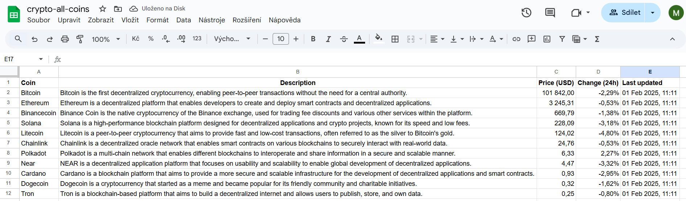

# Cryptocurrency Data Integration Task

This project fetches cryptocurrency data from the CoinGecko API, enhances it with additional information from OpenAI, stores it in an SQLite database, and uploads the aggregated data to Google Sheets.

## Features

1. **Fetch Cryptocurrency Prices**: Retrieves the latest prices and 24-hour changes for a list of cryptocurrencies from the CoinGecko API.
2. **Enhance Data with OpenAI**: Uses OpenAI to provide a description and category for each cryptocurrency.
3. **Store Data in SQLite**: Saves the fetched and enhanced data in an SQLite database.
4. **Aggregate Data**: Aggregates the data by category and calculates average prices and changes.
5. **Upload to Google Sheets**: Uploads both the aggregated data and detailed coin data to Google Sheets.
6. **Format Google Sheets**: Applies formatting to the uploaded data in Google Sheets for better readability.


## Data Processing Overview

The following section demonstrates how data is processed throughout the pipeline, from fetching raw cryptocurrency prices to enhancing it with AI-generated metadata and storing it in a structured database.

The initial data is retrieved from the CoinGecko API, providing real-time cryptocurrency prices and 24-hour percentage changes. The response structure is simple, containing numerical values along with a timestamp.

```json
{
  "binancecoin": {
    "usd": 656.55,
    "usd_24h_change": -2.9404593892183892,
    "last_updated_at": 1738443309
  }
}
  ```
To enrich the raw data, the project utilizes OpenAI to generate a description and categorize each cryptocurrency. This additional metadata provides better insights and classification.

  ```json
{
    "binancecoin": {
      "description": "Binance Coin is the native cryptocurrency of the Binance exchange, used for trading fee discounts and various applications within the Binance ecosystem.",
      "category": "Proof of stake"
    }
}
  ```
The processed dataset combines CoinGecko's real-time market data with OpenAI's enhanced metadata. This final structured JSON format serves as the basis for storage and further analytics.

```json
{
  "binancecoin": {
    "usd": 656.55,
    "usd_24h_change": -2.9404593892183892,
    "last_updated_at": 1738443309,
    "description": "Binance Coin is the native cryptocurrency of the Binance exchange, used for trading fee discounts and various applications within the Binance ecosystem.",
    "category": "Proof of stake"
  }
}
```
The combined data is stored in an SQLite database for structured querying and historical analysis. Below is an example of how the data is structured in the database:

| id  | coin_name   | usd_price | usd_24h_change | last_updated_at | last_updated_dt       | description                                               | category       |
|----|------------|-----------|----------------|-----------------|----------------------|-----------------------------------------------------------|---------------|
| 1  | binancecoin | 656.55    | -2.940459      | 1738443309      | 2025-02-01 20:55:09 | Binance Coin is the native cryptocurrency of t...        | Proof of stake |

After transforming and aggregating the cryptocurrency data in SQLite, the final datasets are uploaded to Google Sheets.

1. Detailed Cryptocurrency Data (crypto-all-coins)




This sheet contains the full list of cryptocurrencies, including their prices, percentage changes, descriptions, and categories.

2. Aggregated Data by Category (crypto-aggregated)


This sheet summarizes the data by category, calculating the average price and 24-hour percentage change for each group (e.g., Proof of work, Proof of stake).

After processing and storing the cryptocurrency data in Google Sheets, the next step is automating the email delivery using Make. The automation flow ensures that the latest data is dynamically retrieved, formatted, and sent via email. Please see `make_blueprint.json`.


After retrieving and processing the cryptocurrency data, the Make automation sends an email containing both the detailed cryptocurrency data and the aggregated category overview.

Below is an example of how the final email appears when sent:


The structured format ensures the recipient receives a clear and concise overview of the latest cryptocurrency market data, making it easy to analyze trends at a glance.


## Setup

1. **Environment Variables**: Create a `.env` file in the `env` directory with the following variables:
    ```
    OPENAI_API_KEY=your_openai_api_key
    ```

2. **Service Account File**: Place your Google Cloud service account JSON file in the `env` directory and update the `SERVICE_ACCOUNT_FILE` constant in the code.

3. **Install Dependencies**: Install the required Python packages using pip:
    ```bash
    pip install -r requirements.txt
    ```

## Usage

1. **Run the Script**: Execute the main script to fetch, enhance, store, aggregate, and upload the data:
    ```bash
    python main.py
    ```

2. **Check Google Sheets**: Verify the uploaded data in your specified Google Sheets.